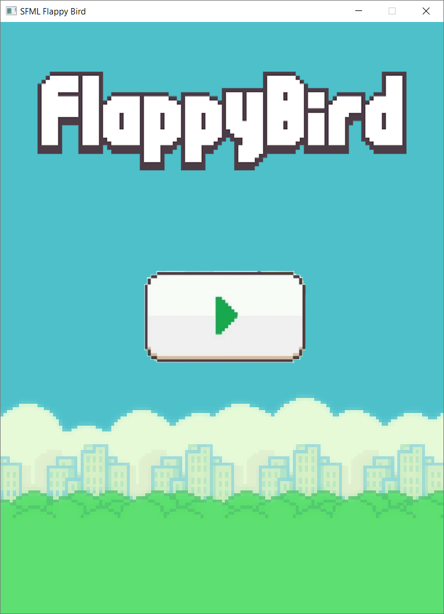
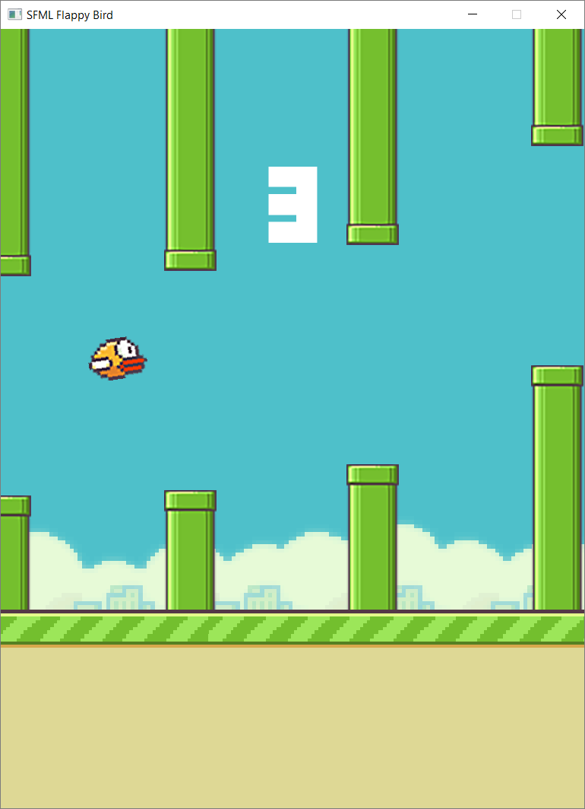

# SFML Flappy Bird
Flappy Bird game clone using SFML as multimedia library. It was created following a [Sonar Learning course](https://www.udemy.com/flappy-bird-sfml/) published on Udemy.

## Execution

 Execute **bin/SFML Flappy Bird.exe**.

